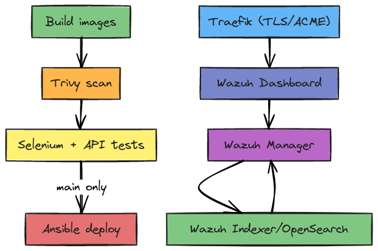

# Mini SOC – Wazuh on Docker Swarm (with CI/CD)

This repository implements the **SOC Architect – Technical Challenge** solution:
- **Part One**: CI/CD that builds, scans, tests, and deploys a Wazuh SIEM onto **Docker Swarm** via **Ansible**.
- **Part Two**: A **custom Wazuh rule** that detects *multiple failed SSH attempts followed by a successful login using a new user*.
- Security-first choices (secrets via GH Actions + Swarm, TLS via Traefik/ACME), quality gates (Trivy, lint), and Selenium/API tests.

> Timestamp of this export: **2025-08-28 20:13 UTC**

---

## Architecture Overview



**Secrets & TLS**
- GH Actions uses **Encrypted Secrets**; Ansible renders **Swarm secrets** for runtime.
- **Traefik** terminates HTTPS and auto‑manages certificates via **Let’s Encrypt/ACME**.
- No secrets in Git; example **Ansible Vault** template is provided.

**Persistence**
- Docker named volumes for Indexer (`wazuh-indexer-data`) and Manager (`wazuh-manager-data`).

**Rollback & Reliability**
- Swarm rolling updates and `docker service update --rollback` support.
- Idempotent Ansible roles: swarm-init → networks → secrets → stack deploy.

---

## Prerequisites

### Self‑hosted runner
- Docker + Docker Swarm CLI
- Ansible (with `community.docker` collection)
- Python 3.10+ with `pip`
- Trivy
- Chrome + Chromedriver (or chromium + chromedriver) for Selenium

> See [`docs/LLD.md`](docs/LLD.md) for exact package names and versions.

### Domain & DNS
- A DNS record pointing to your Swarm ingress node(s) for the dashboard (e.g. `wazuh.example.com`).

---

## How to run locally (quick start)

```bash
# 0) One-time: install Ansible deps on your control host
ansible-galaxy collection install community.docker

# 1) Fill inventory and group variables
cp ansible/inventories/production/hosts.ini.example ansible/inventories/production/hosts.ini
cp ansible/group_vars/all/vault.yml.tpl ansible/group_vars/all/vault.yml  # then edit with your secrets

# 2) Bootstrap & deploy
ansible-playbook -i ansible/inventories/production/hosts.ini ansible/playbooks/deploy.yml

# 3) (Optional) Run smoke tests from your runner/control host
pip install -r requirements.txt
pytest -q tests/selenium/test_dashboard.py
python tests/api/health.py
```

Access the dashboard at: `https://<your_fqdn>`

---

## CI/CD (GitHub Actions)

- On PR and `main` push:
  1) **Build** container images (example tools image shown),
  2) **Scan** with **Trivy** (pipeline fails on Critical/High),
  3) **Test** with Selenium (HTTPS reachable, login form present) and API probe,
  4) **Deploy** with **Ansible** to Swarm (on `main` only after gates pass).

Workflows in: [`.github/workflows/ci.yml`](.github/workflows/ci.yml)

---

## Secrets & TLS

- Secrets provided from **GitHub Encrypted Secrets** → exported to **Swarm secrets**:
  - `WAZUH_ADMIN_PASSWORD`, `OPENSEARCH_ADMIN_PASSWORD`.
- TLS handled by **Traefik** with Let’s Encrypt (ACME HTTP or TLS challenge).

See [`docs/HLD.md`](docs/HLD.md) > *Security posture* and [`ansible/group_vars/all/`](ansible/group_vars/all/) docs.

---

## Wazuh Custom Rule (SSH suspicious pattern)

- Detects **N failed SSH logins** (default 3) from the same IP within **60s**, then a **successful login** from that IP using a **new user** (not seen in last 24h baseline file).
- Files:
  - Decoder: [`wz/decoders/local_decoders.xml`](wz/decoders/local_decoders.xml)
  - Rule: [`wz/rules/local_rules.xml`](wz/rules/local_rules.xml)
  - Baseline list example: [`wz/lists/known_ssh_users.txt`](wz/lists/known_ssh_users.txt)
  - Event generator: [`tests/ssh_rule/generate_events.sh`](tests/ssh_rule/generate_events.sh)

---

## Rollback / Teardown

```bash
ansible-playbook -i ansible/inventories/production/hosts.ini ansible/playbooks/teardown.yml
```

---

## Evidence (placeholders)

- `evidence/ci-run.png` – CI successful run (attach screenshot)
- `evidence/wazuh-dashboard.png` – Dashboard over HTTPS (attach screenshot)
- `evidence/trivy-report.txt` – Sample scan artifact (generated in CI)
- `evidence/ssh-alert.png` – Alert triggered by the custom rule

---

## License

MIT (for this sample scaffold). Wazuh images are subject to their respective licenses.

